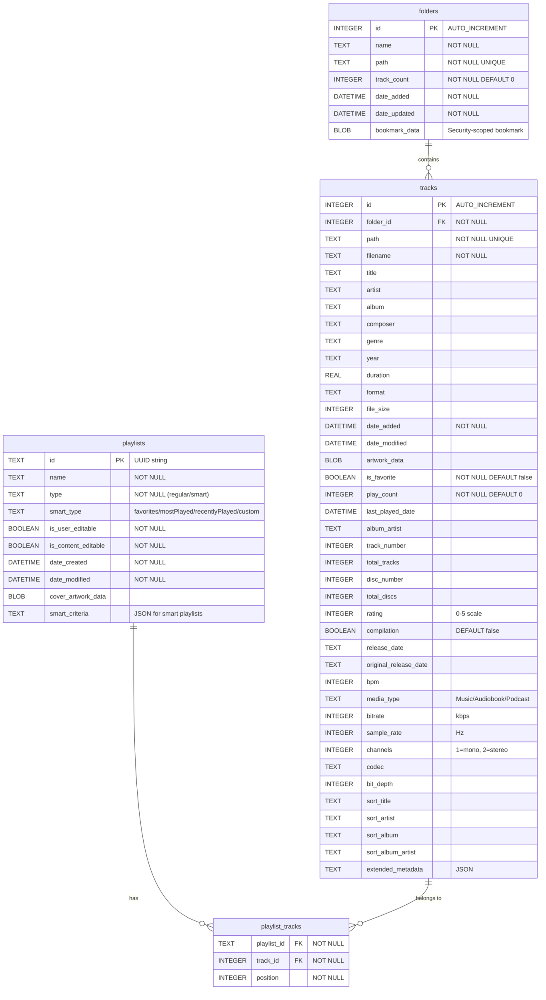

# Petrichor

<div align="center">
  
</div>

_a pleasant smell that frequently accompanies the first rain after a long period of warm, dry weather._ 🌧️

A beautiful, native music player for macOS built with Swift, SwiftUI, and Claude.

[](https://github.com/kushalpandya/Petrichor/actions/workflows/ci.yml)

## ✨ Features

### 🎵 Music Management

- **Folder-based Library**: Add folders containing your music files
- **Automatic Scanning**: Periodic scanning for new music files
- **Metadata Extraction**: Automatic extraction of title, artist, album, genre, and artwork
- **Multiple Audio Formats**: Support for MP3, M4A, WAV, AAC, AIFF, and FLAC

### 🎛️ Playback Controls

- **Full Playback Control**: Play, pause, skip, and seek
- **Volume Control**: Integrated volume slider
- **Repeat Modes**: Off, repeat one, repeat all
- **Shuffle**: Random track playback
- **Media Keys**: Integration with macOS media keys and Now Playing

### 📚 Organization

- **Library View**: Browse all your music in one place
- **Folder View**: Navigate music by folder structure
- **Playlist Support**: Create and manage custom playlists (in development)
- **Smart Search**: Find tracks quickly (planned)

### ⚙️ Native macOS Integration

- **System Audio**: Uses AVFoundation for high-quality audio playback
- **Security Bookmarks**: Secure access to user-selected folders
- **Now Playing Integration**: Shows current track in Control Center and Lock Screen
- **Native UI**: Follows macOS design guidelines with proper system colors and spacing

## 🚀 Getting Started

### Requirements

- macOS 15.4 or later
- Xcode 16.3 or later
- Swift 5.0

### Installation

1. Clone this repository
2. Open `Petrichor.xcodeproj` in Xcode
3. Build and run the project

### First Time Setup

1. Launch Petrichor
2. Go to **Folders** tab
3. Click **Add Folder** to select directories containing your music
4. The app will automatically scan and import your music files

## 🏗️ Architecture

Petrichor follows a clean, modular architecture:

### Core Components

- **Models**: `Track`, `Playlist`, `Folder` - Data structures
- **Managers**: Business logic and state management
  - `LibraryManager` - Music library and folder management
  - `AudioPlayerManager` - Audio playback control
  - `PlaylistManager` - Playlist operations and playback queue
  - `NowPlayingManager` - macOS Now Playing integration
- **Views**: SwiftUI views organized by feature
- **Application**: App coordination and lifecycle management

### Key Design Patterns

- **MVVM Architecture**: Clear separation of concerns
- **ObservableObject**: Reactive state management
- **Dependency Injection**: Managers are injected through environment objects
- **Composition over Inheritance**: Modular, reusable components

## 🛠️ Development

### Project Structure

```
Petrichor/
├── Application/           # App entry point and coordination
├── Models/               # Data models
├── Managers/             # Business logic
├── Views/                # SwiftUI views
└── Assets.xcassets/      # App icons and resources
```

### SQLite Schema

- **folders** - Stores music folders with security-scoped bookmarks
- **tracks** - Comprehensive music metadata with 35+ fields including extended metadata as JSON
- **playlists** - Both regular and smart playlists with criteria
- **playlist_tracks** - Junction table for many-to-many relationship between playlists and tracks

Key relationships:

- Each folder can contain multiple tracks (one-to-many)
- Playlists and tracks have a many-to-many relationship through `playlist_tracks`
- All foreign keys have CASCADE delete to maintain referential integrity

<details>


</details>

### Built With

- **Swift 5.0** - Modern, safe programming language
- **SwiftUI** - Declarative UI framework
- **AVFoundation** - Audio playback and metadata extraction
- **AppKit** - macOS system integration

## 🎯 Roadmap

### Current Status

- ✅ Basic music playback
- ✅ Library management
- ✅ Folder scanning
- ✅ Native macOS integration
- ✅ Settings and preferences

### Planned Features

- 🔄 Complete playlist functionality
- 🔄 Advanced search and filtering
- 🔄 Music visualizations
- 🔄 Keyboard shortcuts
- 🔄 Import/export playlists
- 🔄 Audio effects and equalizer

## 🤖 Built with AI

This entire project was created exclusively using **Claude** (Anthropic's AI assistant). From initial concept to final implementation, every line of code, architectural decision, and feature was developed through AI-assisted programming. This showcases the potential of AI-powered development tools in creating complete, functional applications.

## 📝 License

This project is open source and available under the [MIT License](LICENSE).

## 🙏 Acknowledgments

- **Anthropic's Claude** - For being an exceptional development partner
- **Apple** - For the excellent development tools and frameworks
- **The Swift Community** - For continuous innovation in iOS/macOS development
