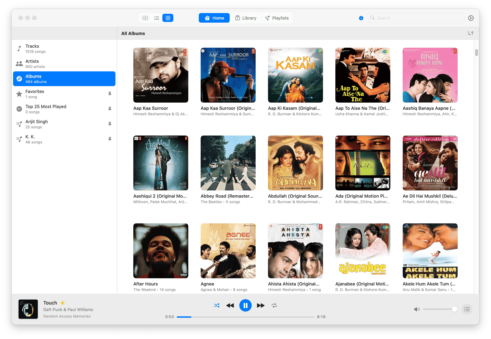
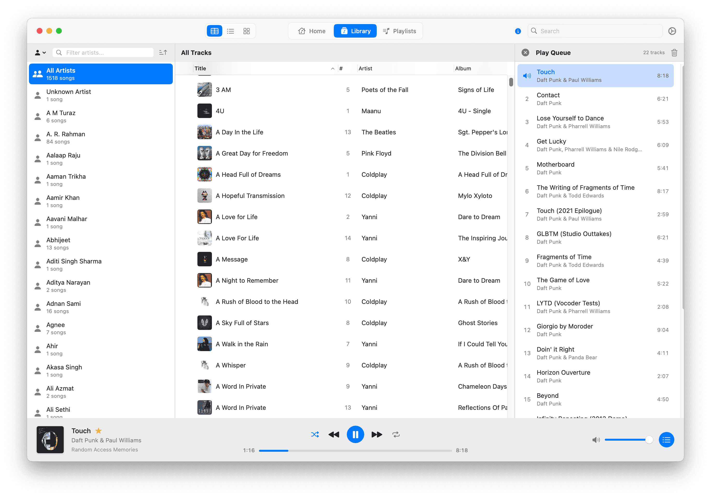
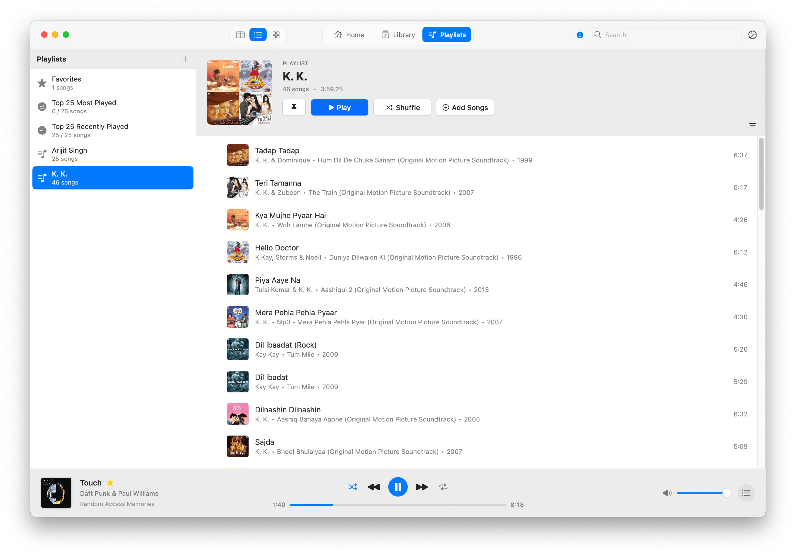
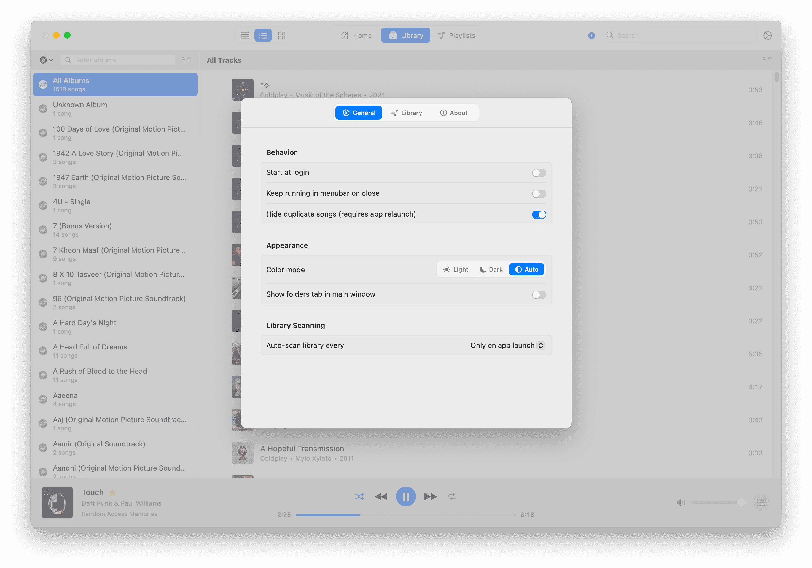
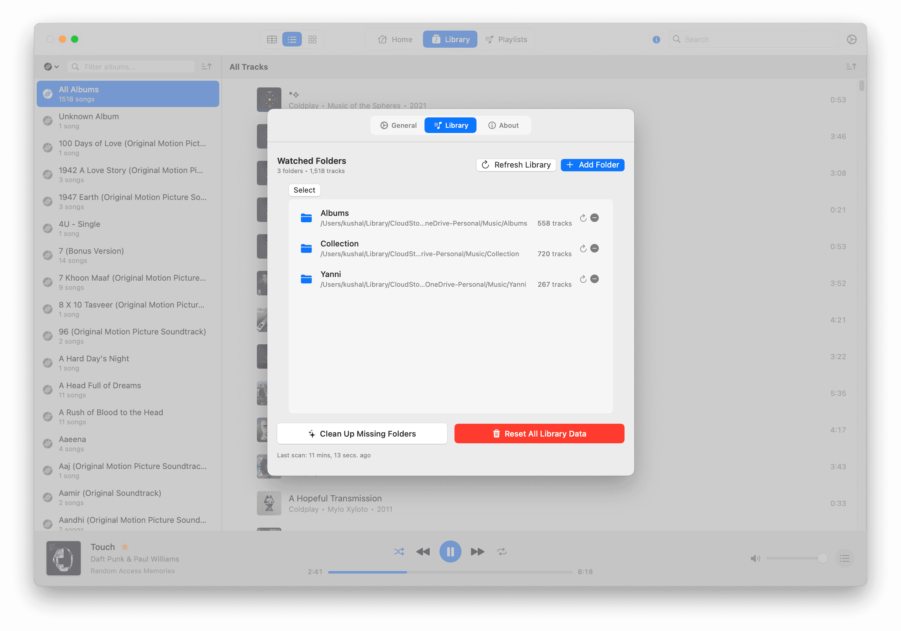

<h3>Petrichor</h3>

An offline music player for macOS

  

 
 

 

## Summary

### ✨ Features

- Everything you'd expect from an offline music player!
- Map your music folders and browse your library in an organized view.
- Create playlists and manage the play queue interactively.
- Browse music using folder view when needed.
- Pin _anything_ (almost!) to the sidebar for quick access to your favorite music.
- Navigate easily: right-click a track to go to its album, artist, year, etc.
- Native macOS integration with menubar and dock playback controls, plus dark mode support.
- Fast and performant, even with large libraries containing thousands of songs.

### ⌛ Planned features

- Smart playlists with user-configurable conditional filters
- AirPlay 2 casting support
- Miniplayer and full-screen modes
- Automatic in-app updates
- Online album & artist information fetching
- ... and much more!

###  Requirements

- macOS 14 or later

### ⚙️ Installation

- Go to [Releases](https://github.com/kushalpandya/Petrichor/releases) and download the latest `.dmg`.
- Open the `.dmg` and drag the app icon into the Applications folder.
- In Applications, right-click **Petrichor > Open**.

_P.S. I plan publish it on Homebrew soon._

### 📷 Screenshots

## 🏗️ Development

### Motivation

I have a large collection of music files that I’ve gathered over the years, and I missed having a good offline
music player on macOS. I used [Swinsian](https://swinsian.com/) (great app, by the way!), but it hasn't been
updated in years. I also missed features commonly found in streaming apps; so I built Petrichor to scratch that
itch and learn Swift and macOS app development along the way!

### Implementation Overview

- Built entirely with Swift and SwiftUI for the best macOS integration.
- Once folders are added, the app scans them and populates a SQLite database using [GRDB](https://github.com/groue/GRDB.swift/).
- Petrichor does **not** alter your music files, it only reads from the directories you add.
- Tracks searching is powered by [SQLite FTS5](https://www.sqlite.org/fts5.html) with fall-back to in-memory search.
- Playback is powered by [AVFoundation](https://developer.apple.com/av-foundation/).

View Database Schema

### Setup

- Make sure you’re running macOS 14 or later.
- Install [Xcode](https://developer.apple.com/xcode/).
- To build the `.dmg` installer using the [`build-installer.sh`](Scripts/build-installer.sh) script, install:
  - [xcpretty](https://github.com/xcpretty/xcpretty)
  - [create-dmg](https://github.com/sindresorhus/create-dmg)

## 📝 License

[MIT](LICENSE)

## 🙏 Credits

- [Paul Hudson](https://www.youtube.com/@twostraws) for creating all those Swift tutorials!
- [create-dmg](https://github.com/sindresorhus/create-dmg) by awesome [Sindre Sorhus](https://sindresorhus.com/)!
- [Claude by Anthropic](https://claude.ai/) for being a peer-programmer for this project!
